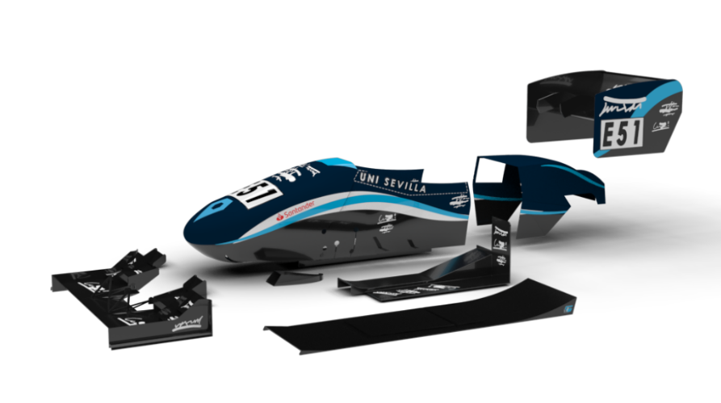
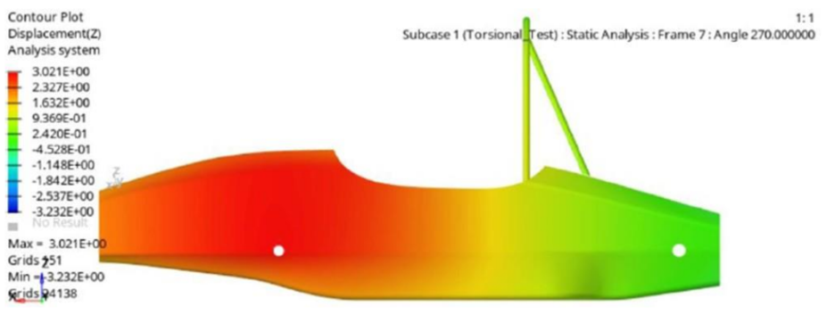
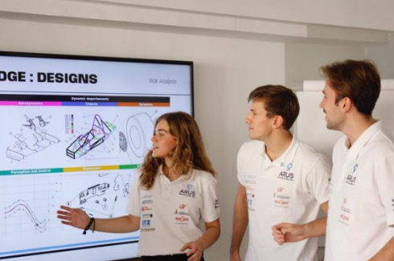
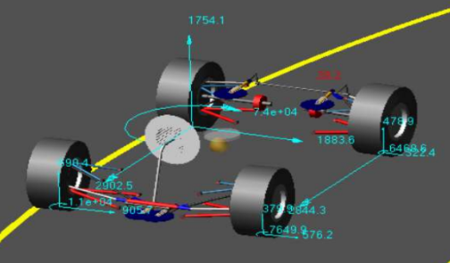
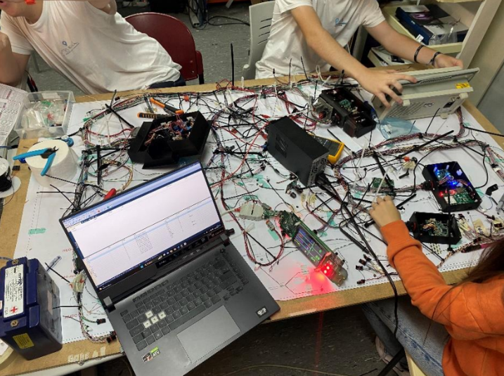
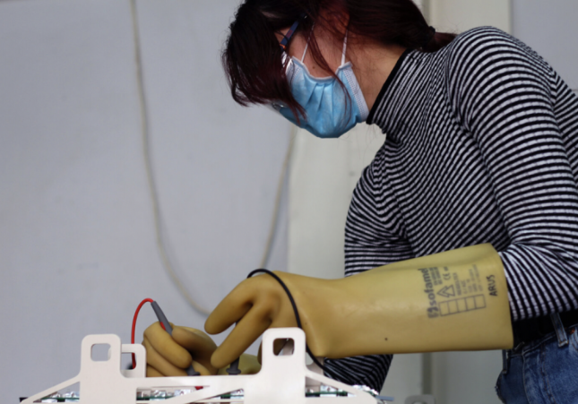
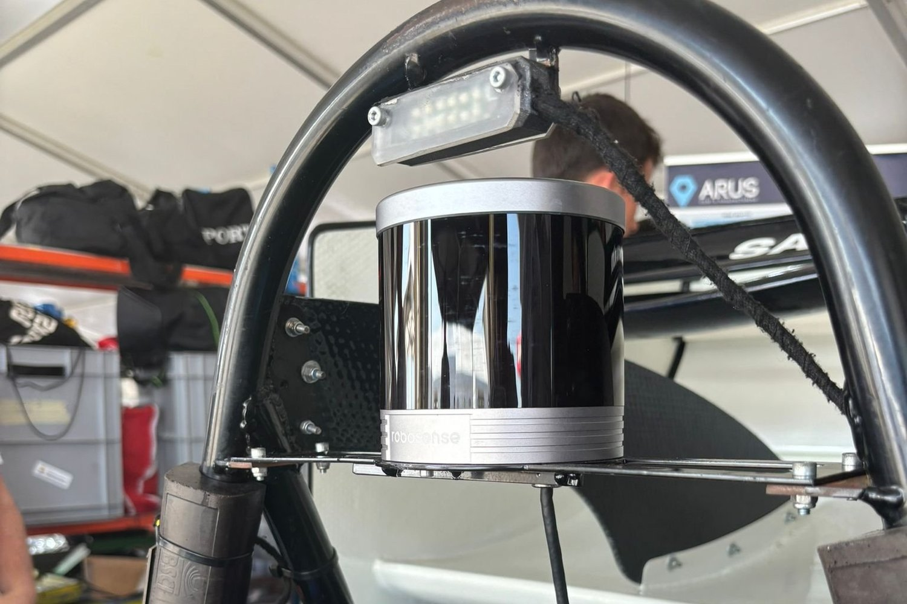
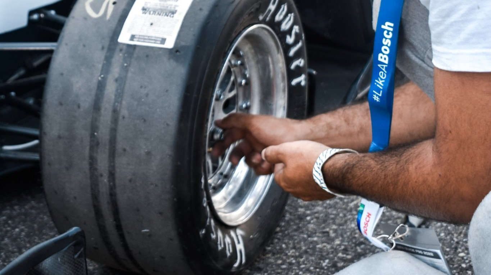
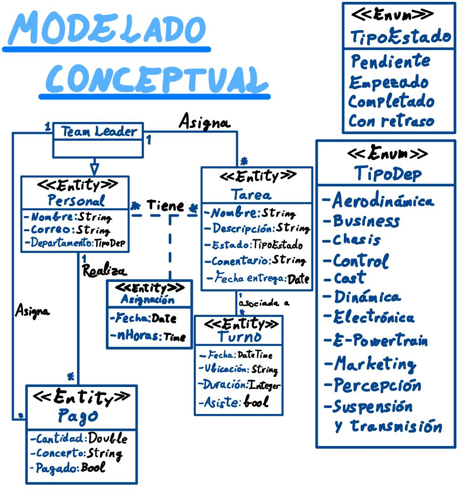

# Título Proyecto

## Miembros del grupo L6-OMD-5 

1. Guil Valero, Rafael
2. Martínez Ocaña, Álvaro
3. López Mangas, David 
4. Ruiz Vidal, Pablo

## 1. Introducción al problema

ARUS Andalucía Racing Team es el equipo de Formula Student de la Universidad de Sevilla, una de las competiciones de ingeniería más prestigiosas a nivel internacional. En este equipo multidisciplinar, formado por más de 100 estudiantes de todas las facultades, se dedican a diseñar, fabricar y validar un monoplaza de competición. Una vez completado, el monoplaza se pone a prueba en diferentes circuitos, compitiendo contra equipos de otras universidades de toda Europa.

El objetivo de estas competiciones no es solo medir la velocidad del vehículo, sino también evaluar aspectos técnicos y de gestión, como la innovación, la eficiencia energética, la capacidad de organización del equipo, el diseño del vehículo, la gestión económica o la visión empresarial, lo que hace que sea una experiencia única para los alumnos. Además, estas competiciones fomentan el trabajo en equipo, la resolución de problemas y la aplicación práctica de los conocimientos adquiridos durante la carrera universitaria.

Para que un equipo de esta nivel funcione, hace falta una gran organización. Cada miembro del equipo tiene un rol específico y debe cumplir con sus responsabilidades de manera eficiente. El equipo está dividido en 11 departamentos y la coordinación entre estos es crucial para el éxito del proyecto.

Han solicitado nuestros servicios para la creación de un sistema que sea capaz de organizar las tareas de los distintos miembros y Team Leaders. Este sistema debe ser capaz de gestionar la asignación de tareas, el seguimiento del progreso y la comunicación entre los miembros del equipo. La implementación de este sistema no solo mejorará la eficiencia del equipo, sino que también proporcionará una herramienta valiosa para la gestión de futuros proyectos.

## 2. Glosario de términos
**Terminos Generales**
- Arus: Equipo de Formula Student de la Universidad de Sevilla.
- Formula Student: Competición universitaria donde se ponen a prueba monoplazas.
- Validar: Proceso que se hace después de la fabricación del monoplaza para comprobar si el diseño cumplen finalmente con los requisitos.
- Team leader: Jefe de departamento.

**Departamentos**

- Aerodinámica: Departamento encargado del estudio de los elementos aerodinámicos del coche.
  
  

- Business: Departamento encargado de elaborar un plan de negocios entorno al coche.
  
  

- Control: Departamento encargado de diseñar e implementar los algoritmos necesarios para el control del coche.
  
  

- Chasis: Departamento encargado de diseñar, fabricar y validar el esqueleto del monoplaza, siempre teniendo en cuenta la seguridad del piloto, tratando de conseguir la mayor rigidez torsional posible y adaptando el monoplaza al piloto.
  
  

- Cost: Departamento encargado de gestionar la organización y producción del equipo incluyendo la gestión de riesgos, recursos e incluso el planteamiento de una planificación de la producción en masa.
  
  

- Dinámica: Departamento encargado de todos los estudios teóricos del coche en la etapa de diseño para después, en pista optimizar la puesta a punto del coche.
  
  

- Electrónica: Departamento encargado de aportar el sistema nervioso del monoplaza, desarrollando un conjunto de sistemas electrónicos con el fin de garantizar el correcto funcionamiento de todos los elementos de seguridad y control.
  
  

- E-Powertrain: Departamento encargado de los sistemas eléctricos del tren de potencia de nuestro monoplaza, consiguiendo que la batería de alta tensión y motores trabajen en completa sinergia.
  
  

- Marketing: Departamento encargado de gestionar la imagen del equipo y de establecer las diferentes líneas comunicativas.
  
  

- Percepción: Departamento encargado de diseñar e implementar algoritmos para percibir el entorno y calcular la ruta deseada que seguirá el coche driverless.
  
  

- Suspensión y transmisión: Departamento encargado de diseñar, fabricar y validar todos los elementos de la suspensión y transmisión del monoplaza.
  
  

**Elementos del Coche**
- Monocasco: Estructura del vehículo que integra el chasis y la carrocería en una sola pieza, proporcionando mayor rigidez y seguridad.
- Suspensión: Sistema del vehículo encargado de absorber las irregularidades del terreno y mantener el contacto de las ruedas con el suelo, mejorando la estabilidad y el control del monoplaza.
- Transmisión: Conjunto de componentes mecánicos que transmiten la potencia del motor a las ruedas, permitiendo el movimiento del monoplaza.
- Piloto: Persona encargada de conducir el monoplaza durante las pruebas y competiciones, asegurando el rendimiento óptimo del vehículo y la seguridad en pista.
- Driverless: Tecnología que permite que el vehículo se conduzca de manera autónoma, sin intervención humana.

## 3. Visión general del sistema

### 3.1. Requisitos generales
Se tratará de un sistema que organice las asignaciones, tareas, turnos y pagos de los distintos usuarios del equipo. También almacenará los datos de estos
### 3.2. Usuarios del sistema
Se diferenciará en 2 tipos de usuarios:
- Team leader: tendrá acceso total al servidor
- Miembro: Podrá ver todo el servidor pero solo podrá editar el estado y el comentario de la tarea

## 4. Catálogo de requisitos

### 4.1. Requisitos funcionales

#### R.F.01. Agregar tareas
Como Team Leader de ARUS
quiero poder asignar tareas a los distintos miembros 
de forma que se ejecuten en un tiempo definido.

**Prueba de aceptación**

- No se podrá asignar una tarea a un integrante fuera del medio, es decir, únicamente a usuarios del sistema. 
- Se aplicará la R.N.02.

#### R.F.02. Eliminar tareas
Como Team Leader de ARUS
quiero poder eliminar tareas 
de forma que aquellas que ya han sido realizadas correctamente o hayan sido asignadas erroneamente no aparezcan en el sistema.

**Prueba de aceptación**

- La tarea debe existir previamente para poder ser eliminada. 
- Se aplicará la R.N.02.

#### R.F.03. Agregar usuarios al sistema
Como Team Leader de ARUS quiero
poder agregar nuevos usuarios al sistema de forma que puedan acceder y utilizar las funcionalidades del sistema.

**Prueba de aceptación**

- El sistema debe permitir al Team Leader crear nuevos perfiles de usuario con información básica (nombre, departamento, correo electrónico, rol). 
- El sistema debe validar que el usuario no esté ya registrado en el sistema.
- Se aplicará la R.N.01.

#### R.F.04. Eliminar usuarios del sistema
Como Team Leader de ARUS quiero
poder eliminar usuarios del sistema los cuales ya no pertenecen al equipo. Estos ya no podrán acceder al sistema

**Prueba de aceptación**

- El sistema debe permitir al Team Leader eliminar perfiles. 
- El sistema debe validar que el usuario estuviese ya registrado en el sistema.
- Se aplicará la R.N.01.

#### R.F.05. Gestión de comentarios en las tareas
Como usuario del sistema quiero 
poder agregar y editar comentarios en las tareas de forma que pueda proporcionar actualizaciones y feedback.

**Prueba de aceptación**

- Los miembros deben poder agregar y editar comentarios en cualquier tarea asignada a ellos.
- Los comentarios deben ser visibles para todos los usuarios del sistema.
- Se aplicará la R.N.03.

#### 4.1.1. Requisitos de información

##### R.I.01. Información Tarea

Como usuario del sistema quiero que el sistema almacene informacion sobre las tareas: (nombre, descripción, estado (pendiente, empezado, completada, con retraso), comentario y miembro asignado)

**Prueba de aceptación**
- La información debe ser accesible para todos los usuarios.

##### R.I.02. Información persona
Como usuario del sistema quiero que el sistema almacene informacion sobre todos los miembros del equipo (nombre completo, correo electronico, departamento y rol).

**Prueba de aceptación**
- La información debe ser accesible para todos los usuarios.

##### R.I.03. Información pago
Como Team Leader quiero conocer la cantidad que se realiza de pago, el concepto del pago y si se ha realizado o no dicho pago.

**Prueba de aceptación**
- La información debe ser accesible unicamente por el Team Leader.

##### R.I.04. Información turno
Como usuario del sistema quiero conocer los distintos turnos que hay asignados entre los distintos usuarios.

**Prueba de aceptación**
- La información debe ser accesible para todos los usuarios.
  
##### R.I.05. Información asignación
Como usuario del sistema quiero ver la fecha en la que se ha asignado una tarea a un miembro y el tiempo en horas que lleva asignada

**Prueba de aceptación**
- La información debe ser accesible para todos los usuarios.

#### R.I.06. Filtrado y búsqueda de tareas
Como usuario del sistema quiero 
poder filtrar y buscar tareas por diferentes criterios (estado, miembro asignado, etc.) de forma que pueda encontrar rápidamente la información que necesito.

**Prueba de aceptación**

- El sistema debe permitir a los usuarios filtrar tareas por estado, miembro asignado y otros criterios relevantes.

#### R.I.07. Filtrado y búsqueda de usuarios
Como usuario del sistema quiero poder filtrar y buscar usuarios por diferentes criterios (nombre, correo y departamento) de forma que pueda encontrar rápidamente al usuario que necesito.

**Prueba de aceptación**

- El sistema debe permitir a los usuarios filtrar por nombre, correo y departamento para localizar al usuario deseado.

#### R.I.08. Filtrado y búsqueda de deudores
Como usuario del sistema quiero poder encontrar al personal que no haya realizado sus pagos correctamente filtrando por nombre, cantidad, concepto y si se ha realizado o no.

**Prueba de aceptación**

- El sistema debe permitir a los usuarios filtrar por nombre, cantidad, concepto y realizado para controlar los pagos de los usuarios.

#### R.I.09. Facturación
Como Team Leader, tengo la responsabilidad de estar informado sobre ciertos indicadores clave del negocio.
Uno de estos indicadores es la cantidad total de facturación a realizar por parte de la empresa.
Esto significa que debo tener acceso a los datos financieros consolidados que reflejan el volumen total de ingresos esperados o proyectados.

**Prueba de aceptación**

- El sistema debe permitir al TeamLeader filtrar por la cantidad total para controlar los importes de facturación.

#### 4.1.2. Reglas de negocio

##### R.N.01. Registro de personal
- Todo miembro o Team Leader debe estar registrado en el sistema para poder ver sus tareas
- Solo los Team Leaders pueden añadir usuarios
- El correo electrónico del usuario añadido debe acabar en @alum.us.es
  
**Prueba de aceptación**
- Comprobar que el departamento añadido coincide entre los departamentos existentes
- Comprobar que solo hay un Team Leader por departamento

##### R.N.02. Añadir, eliminar y editar tareas
- Solo podran añadir y eliminar tareas los Team Leader.
- El Team Leader podrá editar todos los datos de la tarea (el nombre, la descripción, el estado (pendiente, empezado, completada, con retraso) y algún comentario)
- Si se excede el plazo de entrega de una tarea, el estado de la tarea pasará a ser "con retraso".
- El miembro podrá ver todas las tareas de todos los usuarios, pero no podrá editar todo, solo el estado y los comentarios

**Prueba de aceptación**
- Comprobar que la tarea tiene un nombre y un usuario asignado

##### R.N.03. Número de TLs
En cada departamento de la organización, la figura del Team Leader es única y exclusiva.
Esto significa que no puede coexistir más de un Team Leader en el mismo departamento al mismo tiempo.

**Prueba de aceptación**
- Comprobar que cada departamento posee unicamente a un Team Leader.

-- fin entregable 1 --

## 5. Modelo conceptual

  

## 6. Matrices de trazabilidad

- Matriz de trazabilidad entre los elementos del modelo conceptual y los requisitos.

|                                               | Turno      | Tarea       | Usuario    | Pagos      | Team Leader | Asignación |
|:----------------------------------------------|:-----------|:----------- |:-----------|:-----------|:------------|:-----------|
| R.I.01. Información Tareas                    | X          | X           | X          |            | X           |            |
| R.I.02.Información miembros                   | X          |             | X          | X          | X           |            |
| R.I.03.Información pago                       |            |             |            | X          | X           |            |
| R.I.04.Información turno                      | X          |             | X          |            | X           |            |
| R.I.05.Información asignacion                 |            |             | X          |            | X           | X          |
| R.I.06.Filtrado y búsqueda de tareas          |            | X           | X          |            | X           |            |
| R.I.07.Filtrado y búsqueda de usuarios        |            |             | X          |            | X           |            |
| R.I.08.Filtrado y búsqueda de deudores        |            |             | X          | X          | X           |            |
| R.I.09.Facturación                            |            |             |            | X          | X           |            |
| R.F.01.Agregar tareas                         |            | X           |            |            | X           | X          |
| R.F.02.Eliminar tareas                        |            | X           |            |            | X           | X          |
| R.F.03.Agregar usuarios al sistema            |            |             |            |            | X           |            |
| R.F.04.Eliminar usuarios del sistema          |            |             |            |            | X           |            |
| R.F.05.Gestión de comentarios en las tareas   |            | X           | X          |            | X           |            |
| R.N.01. Registro de personal                  |            |             | X          |            | X           |            |
| R.N.02. Añadir, eliminar y editar tareas      |            | X           |            |            | X           | X          |
| R.N.03. Número de Team Leaders                |            |             |            |            | X           |            |

- Incluir Reglas de negocio — Constraints/Triggers en las matrices de trazabilidad para el entregable 3

|         | RN-1 Registro de personal     | RN-2 Añadir, eliminar y editar tareas   | RN-3 Número de Team Leaders     |
|:------- |:-------                       |:-------                                 |:-------                         |
| tInsertPersona  |  X                             |                                         |                                 |
| tTareaInsert  |                              |            X                            |                                |
| tTareaDelete  |                             | X                                 |                                |
|  tUpdateTarea  |                               |         X                                |                                 |
|  tNumeroTLPorDepartamento  |                               |                                         |    X                             |
|  tTareaInsertFechaEntrega  |                               |         X                                |                                 |

|         | RN-1 Registro de personal   | RN-2 Añadir, eliminar y editar tareas   | RN-3  Número de Team Leaders |
|:------- |:-------                     |:-------                                 |:-------                      |
| correoCheck |       X                      |                                         |                              |

-- fin entregable 2 --

## 7. Modelo relacional en 3FN

--- Relaciones obtenidas al aplicar la transformación del modelo conceptual:---
 -TeamLeader(!id, @(personalId, pagoId))
-Personal(!id, nombre, correo, @(tipoDepId, tipoRolId), @tareaId) 
-Tarea(!id, nombre, descripcion, @tipoEstadoId, comentario, fechaEntrega, @turnoId)
-Turno(!id, fecha, ubicacion, duracion, asistencia)
-Pago(!id, cantidad, concepto, pagoRealizado)

### 7.1.  Justificación de la estrategia de transformación de jerarquías
A partir del modelado conceptual observamos que la clase principal es personal, que a su vez está asociada a la subclase Team Leader. Peor tanto la relación jerárquica que sacamos se nos muestra en el siguiente codigo:

-TeamLeader(teamleaderId)
            PK(teamleaderId)
-Persona(personaId, nombre, correo, departamento,rol)
            PK(personaId)
            AK(nombre)
            AK(correo)
            FK(departamento)/TeamLeader
            FK(rol)/TeamLeader

##8 Matrices de trazabilidad

-- fin entregable 3 --

## Referencias 
